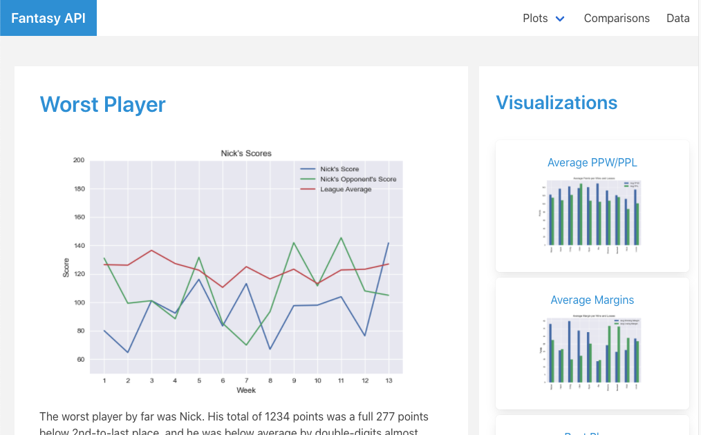
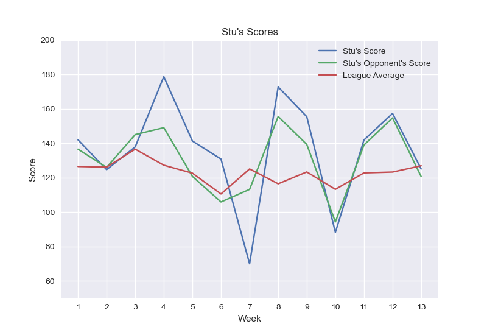

# Web Design Challenege

## Overview

The goal of this assignment was to create a simple dashboard to display some data visualizations. Nothing fancy happening server-side, just some static HTML pages showcasing a few plots of weather data, with a navbar up top and some responsiveness using Bootstrap columns.

I couldn't bring myself to do it though. Initially it was a Flask app with SCSS for customizing Bootstrap, but that hit the skids as soon as I finally tried to deploy it. Instead, I ended up with this [Vue/Bulma app](https://sjwyates.github.io/web-design-challenge/) centered around my fantasy football league:

## ESPN fantasy football API

Fantasy football is stupidly addictive, so I'd been toying around with the idea of using the ESPN fantasy API for a while. It's a public API, but notoriously undocumented, and no amount of pretty-printing can help make sense of the tangled mess it returns. Luckily, I found a pretty cool [API interface](https://github.com/cwendt94/espn-api/wiki/Football-Intro) that made it much easier. With that in hand, plus some Pandas and Matplotlib, I was able to take my whole fantasy season and distill it down to a few simple truths, like that I occasionally have embarrassingly bad weeks:

And yet I made the playoffs, despite my insistence on picking only joke quarterbacks. (Sorry Daniel Jones, I didn't pick you every single week because I think you're fantasy dynamite.)

## Vue and Bulma

I went with [Vue](https://vuejs.org/), because it's great and makes it super easy to manage state and design reactive components. I didn't bother digging up my old recipes, I just used the [Vue CLI](https://cli.vuejs.org/) to stand up a quick prototype, then I added [Vue-Router](https://router.vuejs.org/) because it seems strange to have a navbar without a frontend router. (During my initial attempts with Flask, that was the one aspect of client-side rendering I missed the most.)

I'd also gotten a bit tired of using Bootstrap in class, so I called an audible and substituted in [Bulma](https://bulma.io/). Not that I hate Bootstrap with as much of a passion as a lot of people, it's just that Bulma's more lightweight and feels breezier and less opinionated.

Once I started using Bulma, and with npm already initialized, I thought I might as well throw [Sass](https://sass-lang.com/) into the mix, but to be honest I didn't put it to use much in the end. After all, the original motivation for using SCSS in the initial Flask iteration was to make it look less Bootstrapy, and switching to Bulma already accomplished that.

## Conclusions

There's a lot more I would add to this if it weren't pretty overboard and past deadline already. There's still quite a bit of hard-coding, and I'd really like to do some Bulma Sass customization, but I'll leave it there for now.

If you have any questions, I'm always happy to chat.

Cheers